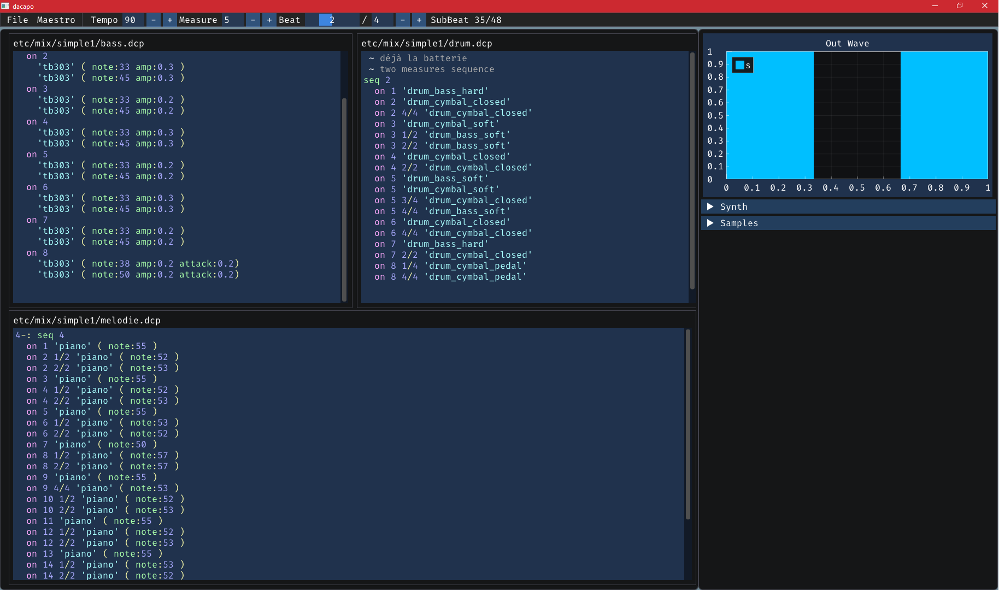

# dacapo

I had two toy projects : one messing around [ImGui](https://github.com/ocornut/imgui)
and the other with [Supercollider](https://github.com/supercollider/supercollider).

So what more natural than mixing them into a third toy project ?

If you are familiar with live-coding using things like overtone
or [sonic-pi](https://github.com/samaaron/sonic-pi),
then it's exactly like that, except with a lot less features.

